# LLMOps

面向 AI 应用开发与运营的一体化平台。通过提示词、模型、知识库和插件完成应用编排，并提供调试、发布、独立对话页与 OpenAPI 接入能力。

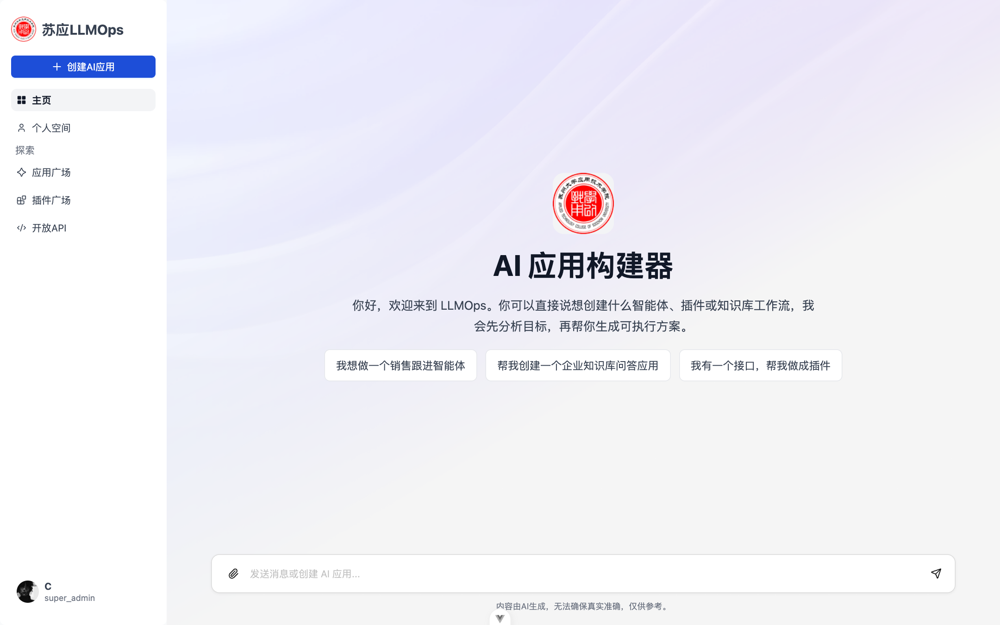

## 功能

| 模块 | 能力 |
| --- | --- |
| AI 应用 | 可视化编排提示词、模型、知识库和插件；支持实时调试、草稿保存、版本发布/恢复、发布配置和运行统计 |
| 对话 | SSE 流式响应、会话管理、文件附件、知识引用、插件调用、长期记忆、追问建议、语音输入与语音输出 |
| 知识库 | 支持 TXT、Markdown、JSON、CSV、HTML、PDF、Word、Excel 和图片；提供解析、清洗、分块、向量化、混合召回、Rerank、召回测试和片段编辑 |
| 插件 | 导入 OpenAPI Schema，自动生成工具定义并执行接口调用，支持自定义鉴权请求头 |
| 模型 | 统一管理 Chat、Embedding、Rerank、多模态、结构化输出、STT 和 TTS 模型，兼容 OpenAI 风格接口 |
| 后台管理 | 独立的 Admin 管理端，统一创建、编辑、启停、删除和连通性测试系统模型 |
| 开放 API | 管理 API Key，通过流式或非流式接口将已发布应用接入外部系统 |
| 网页剪藏 | 浏览器扩展可选择网页正文、清洗为 Markdown 并上传至知识库 |

## 创建与发布流程

`后台配置模型 → 创建应用 → 准备插件 → 准备知识库 → 上传文档 → 管理切片 → 召回测试 → 应用编排 → 发布 → 统计 → 独立对话页 / 开放 API`

### 1. 创建 AI 应用

填写应用图片、名称、分类和描述。创建完成后可进入应用编排，继续配置模型与应用能力。

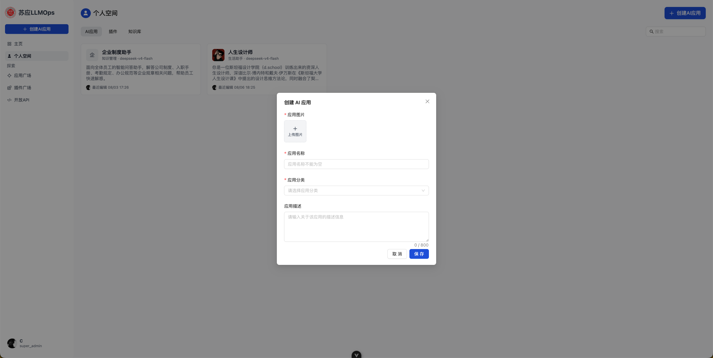

### 2. 创建插件

导入 OpenAPI Schema，配置插件分类和鉴权请求头。系统会解析接口并生成可供模型调用的工具，插件发布后可被其他应用复用。

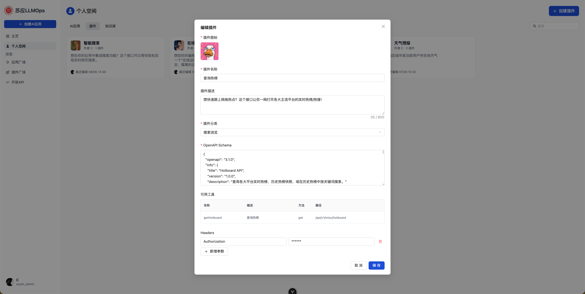

### 3. 创建知识库

填写知识库名称和描述，用于集中管理应用需要检索的文档与切片。

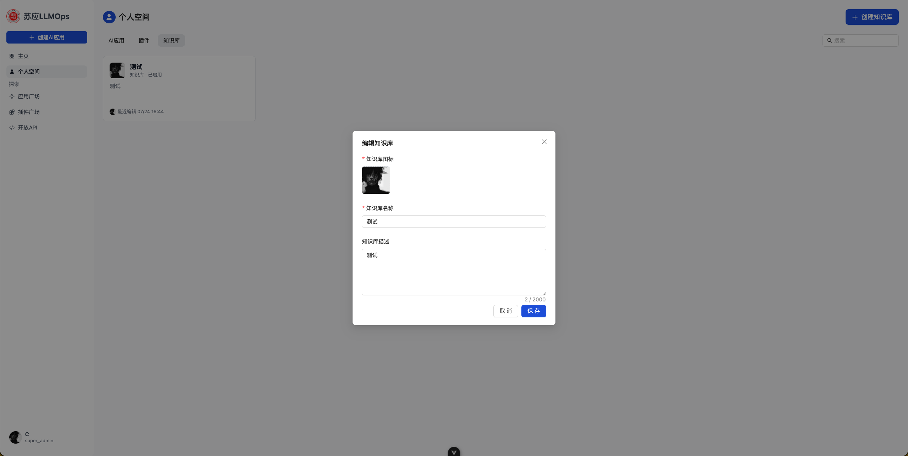

### 4. 上传知识库文档

上传 PDF、TXT、Word、Markdown、JSON、CSV、HTML、Excel 或图片。处理流程分为上传、分段设置和数据处理三个阶段，支持自动分段或自定义分段规则。

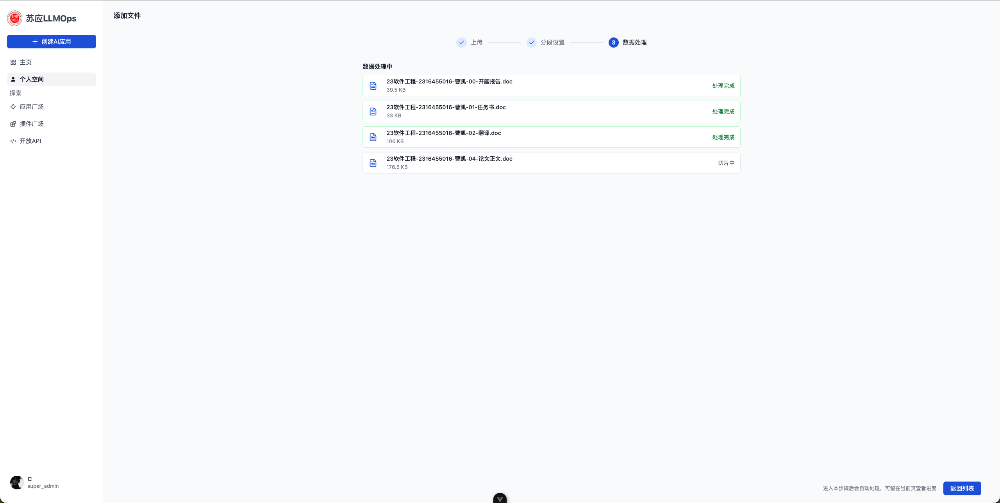

### 5. 管理文档切片

查看文档解析后的切片、字符数和命中次数；支持搜索、启用或禁用、编辑关键词、手动添加和删除切片。

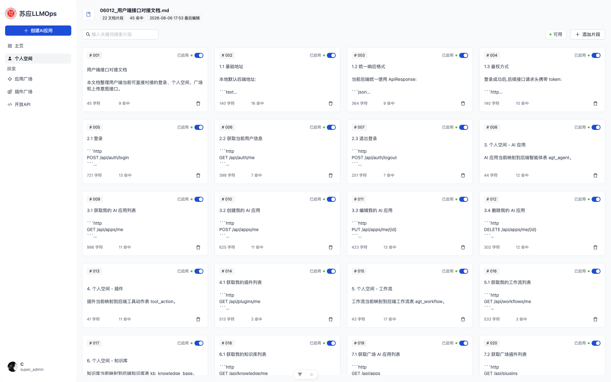

### 6. 召回测试

输入真实问题验证知识库检索效果。支持混合检索、向量检索和全文检索，并可调整召回数量、最低匹配度和向量权重。

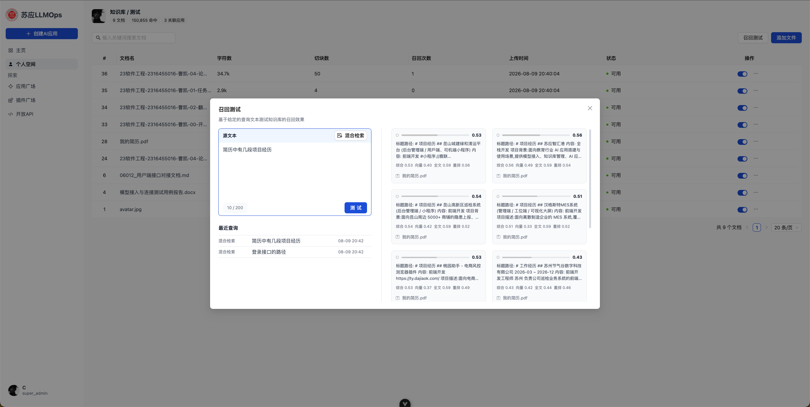

### 7. 应用编排

选择模型并编辑提示词，关联插件与知识库，配置长期记忆、追问建议、语音输入输出和对话开场白。右侧实时预览和调试当前草稿，修改内容自动保存。

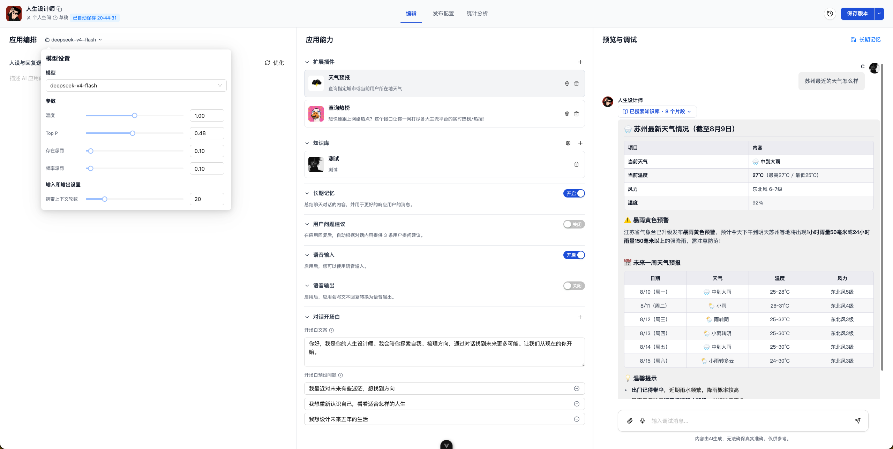

### 8. 发布应用

保存正式版本后生成独立对话页地址，可复制链接、直接访问、发布或下线。未发布时仅应用创建者可访问。

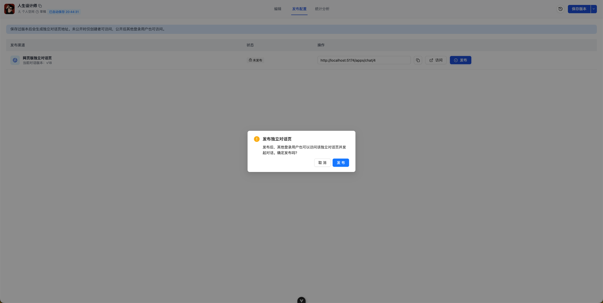

### 9. 查看统计

按近 7 天或 30 天查看 Token 消耗、输出速度、新增会话和活跃用户，并展示趋势图与单次回复明细。

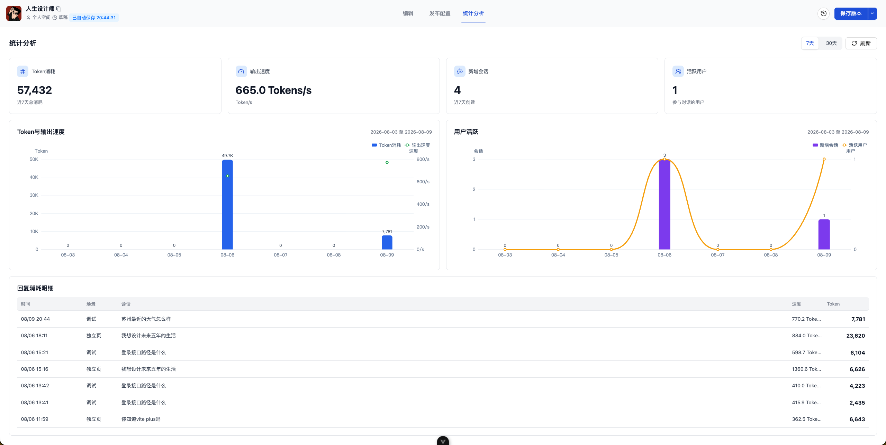

### 10. 使用独立对话页

发布后的应用可通过独立页面使用。页面包含会话列表、新建会话、历史消息、附件上传和预设问题，用户无需进入编排页面。

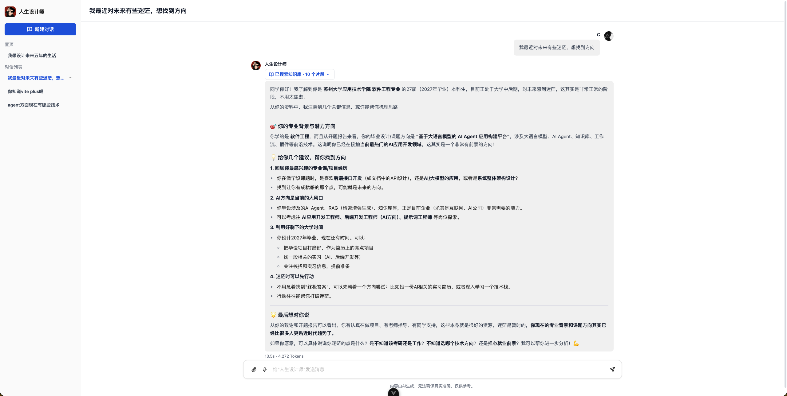

### 11. 通过开放 API 调用

开放 API 复用正式版本中的提示词、模型、知识库和插件配置，支持流式与非流式响应。请求使用 `app_id`、终端用户 ID 和会话 ID 维持上下文。

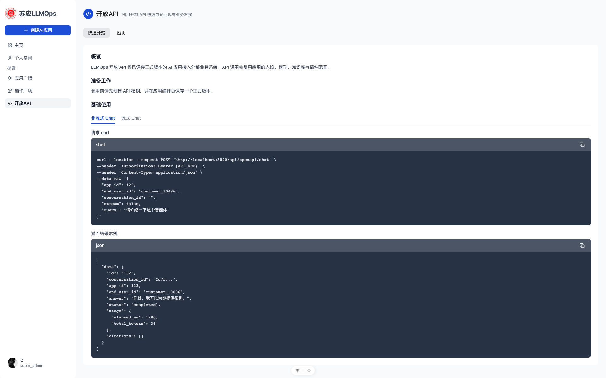

### 12. 管理 API 密钥

创建、启用、禁用或删除 API 密钥，并通过备注区分调用场景。完整密钥只在创建成功时展示一次。

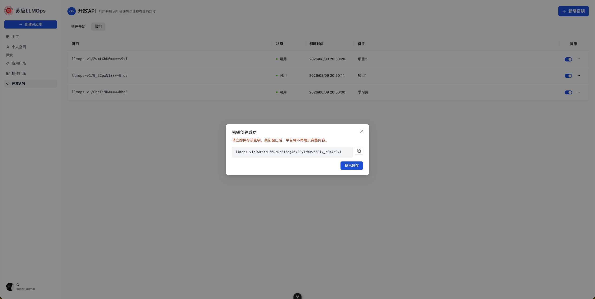

## 后台管理系统

Admin 是独立于用户端的后台管理系统。进入“AI 管理 → 模型管理”可按模型用途维护服务地址和 API Key，并执行启停、删除与连通性测试；启用后的 Chat 模型会出现在用户端应用编排页。

## 技术架构

| 层级 | 技术 |
| --- | --- |
| 用户端 | Vue 3、Vite、Pinia、Ant Design X Vue、ECharts |
| 管理端 | Vue 3、Vite、Vben Admin、Ant Design Vue |
| API | NestJS、TypeORM、BullMQ、LangChain |
| 数据 | PostgreSQL、Redis、Qdrant |
| 文件 | 阿里云 OSS |

```text
apps/
├── frontend           Web 用户端
├── admin              后台管理系统
├── backend            NestJS API 服务
└── browser-extension  网页剪藏浏览器扩展
```

## 快速启动

需要 Node.js ^22.19.0 或 ^24.12.0、pnpm 11.7.0 和 Docker。

### 1. 启动依赖

```bash
docker run -d --name llmops-postgres -e POSTGRES_PASSWORD=postgres -e POSTGRES_DB=llmops -p 5432:5432 -v llmops-pg:/var/lib/postgresql/data postgres:16
docker run -d --name llmops-redis -p 6379:6379 -v llmops-redis:/data redis:7
docker run -d --name llmops-qdrant -p 6333:6333 -v llmops-qdrant:/qdrant/storage qdrant/qdrant
```

### 2. 配置环境变量

```bash
cp apps/backend/.env.example apps/backend/.env
cp apps/frontend/.env.example apps/frontend/.env
```

按下方“环境配置”填写数据库、Redis、JWT、OSS 等基础配置；模型服务在启动后进入 Admin 配置。

### 3. 安装并启动

根目录执行：

```bash
pnpm install
pnpm dev
```

Admin 是独立工作区，另开终端执行：

```bash
cd apps/admin
pnpm install
pnpm dev
```

### 4. 访问系统

| 服务 | 地址 |
| --- | --- |
| Web 用户端 | `http://localhost:5173` |
| Admin 后台 | `http://localhost:5999` |
| API | `http://localhost:3000/api` |
| Qdrant | `http://localhost:6333` |

空数据库首次运行时创建登录账号：

```bash
curl -X POST http://localhost:3000/api/auth/register \
  -H 'Content-Type: application/json' \
  -d '{"username":"super_admin","password":"123456","confirmPassword":"123456"}'
```

使用 `super_admin / 123456` 登录用户端或 Admin 后台。

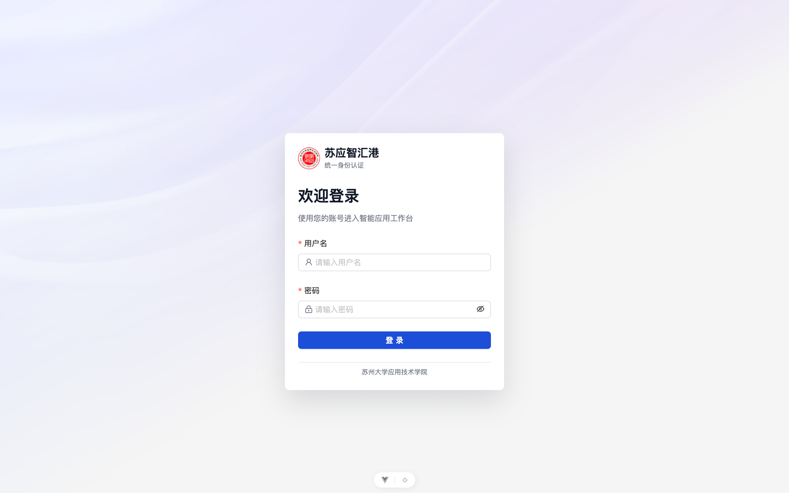

## 环境配置

### Backend

`apps/backend/.env` 完整配置：

```dotenv
# 服务与跨域
PORT=3000
CORS_ORIGINS=http://localhost:5173,http://localhost:5999

# 数据库：支持 postgres / mysql
DB_TYPE=postgres
DB_HOST=127.0.0.1
DB_PORT=5432
DB_USERNAME=postgres
DB_PASSWORD=postgres
DB_DATABASE=llmops
DB_SYNC=true

# Redis
REDIS_HOST=127.0.0.1
REDIS_PORT=6379
REDIS_USERNAME=
REDIS_PASSWORD=
REDIS_DB=0
REDIS_KEY_PREFIX=llmops:

# JWT
JWT_ACCESS_SECRET=replace-with-a-random-secret
JWT_ACCESS_EXPIRES_IN=30m
JWT_REFRESH_SECRET=replace-with-another-random-secret
JWT_REFRESH_EXPIRES_IN=7d

# SMTP；不使用邮件时设为 false，其余字段可留空
MAIL_ENABLED=true
MAIL_HOST=smtp.example.com
MAIL_PORT=465
MAIL_SECURE=true
MAIL_IGNORE_TLS=false
MAIL_USER=your-smtp-user
MAIL_PASS=your-smtp-password
MAIL_FROM_NAME=llmops
MAIL_FROM_ADDRESS=noreply@example.com

# 阿里云 OSS；完整文件上传功能必须启用
OSS_ENABLED=true
OSS_REGION=oss-cn-hangzhou
OSS_BUCKET=your-bucket
OSS_ACCESS_KEY_ID=your-access-key-id
OSS_ACCESS_KEY_SECRET=your-access-key-secret
OSS_PUBLIC_BASE_URL=
OSS_UPLOAD_EXPIRES_IN=3600
OSS_UPLOAD_MAX_SIZE=10485760
OSS_TEMP_EXPIRES_IN_HOURS=24

# Qdrant；知识库与聊天附件的向量化、召回需要
QDRANT_URL=http://127.0.0.1:6333
QDRANT_COLLECTION=ai_knowledge_chunks

# 日志
LOG_ON=true
LOG_LEVEL=info
```

### Frontend

`apps/frontend/.env`：

```dotenv
VITE_APP_NAME=llmops
VITE_API_BASE_URL=http://127.0.0.1:3000/api
```

### Admin

配置位于 `apps/admin/apps/web-antdv-next`：

```dotenv
# .env
VITE_APP_TITLE=LLMOps Admin
VITE_APP_NAMESPACE=llmops-admin
VITE_APP_STORE_SECURE_KEY=replace-with-a-random-secret

# .env.development
VITE_PORT=5999
VITE_BASE=/
VITE_GLOB_API_URL=/api
VITE_NITRO_MOCK=false
VITE_DEVTOOLS=false
VITE_INJECT_APP_LOADING=true
```

开发环境中 `/api` 会代理到 `http://localhost:3000/api`。生产环境需由网关或反向代理将管理端的 `/api` 转发到后端服务。

配置说明：

| 配置 | 作用 |
| --- | --- |
| `DB_*`、`REDIS_*`、`JWT_*` | 登录、会话和全部业务数据，启动必需 |
| `OSS_*` | 知识库文档、应用/插件/知识库图片、聊天附件、浏览器剪藏上传 |
| `QDRANT_*` | 知识库和聊天附件的向量索引与召回 |
| `MAIL_*` | SMTP 邮件发送；启用后必须填写主机和发件邮箱 |
| `CORS_ORIGINS` | 允许访问 API 的前端来源，多个地址用英文逗号分隔 |
| `LOG_*` | 日志开关与级别，可选 `error`、`warn`、`info`、`http`、`verbose`、`debug`、`silly` |

`OSS_ENABLED=false` 仅适合不使用上传功能的场景，当前版本没有本地文件存储回退。生产环境必须设置 `DB_SYNC=false`，并使用独立随机 JWT 密钥；不要提交数据库密码、SMTP 密码、OSS 密钥和模型 API Key。

开发环境默认启用 `DB_SYNC=true`，首次启动会自动创建数据表；生产环境必须改为 `false`。

## 使用前配置

模型配置保存在数据库中，不写入 `.env`。登录后台管理系统，进入“AI 管理 → 模型管理”创建并测试模型，也可直接调用 `/api/ai/llms`；每条配置包含 `usageType`、`modelName`、`baseUrl`、`apiKey` 和 `enabled`。

| `usageType` | 对应功能 | 是否必需 |
| --- | --- | --- |
| `chat` | 应用编排、调试和对话 | 必需 |
| `structured` | 记忆提取、问题建议、知识清洗/增强/关键词 | 建议配置 |
| `built_in_large` | 首页 AI 创建应用 | 使用该功能时必需 |
| `embedding` | 知识库、聊天附件向量化和召回 | 使用知识功能时必需 |
| `multimodal` | 图片及 Office 文档的多模态内容提取 | 使用该类文档时必需 |
| `rerank` | 召回结果重排 | 可选 |
| `speech_to_text` | 语音输入 | 使用语音输入时必需 |
| `text_to_speech` | 语音输出 | 使用语音输出时必需 |

创建模型示例：

```bash
curl -X POST http://localhost:3000/api/ai/llms \
  -H 'Authorization: Bearer <ACCESS_TOKEN>' \
  -H 'Content-Type: application/json' \
  -d '{"usageType":"chat","modelName":"your-model","baseUrl":"https://your-provider.example/v1","apiKey":"your-api-key","enabled":true}'
```

`chat`、`embedding` 使用 OpenAI 兼容接口；语音模型只支持 HTTP/OpenAI 兼容接口，不支持 WebSocket 地址。除 `chat` 外，同一用途同时只会启用一个系统模型。

## 浏览器扩展

```bash
pnpm --dir apps/browser-extension build
```

在 Chromium 浏览器的扩展管理页启用开发者模式，加载 `apps/browser-extension/dist`。扩展使用 Web 端账号登录，可完成网页选区、Markdown 清洗和知识库上传。

## 常用命令

| 执行目录 | 命令 | 说明 |
| --- | --- | --- |
| 项目根目录 | `pnpm dev` | 启动用户端、API 和浏览器扩展构建监听 |
| `apps/admin` | `pnpm dev` | 启动 Admin 后台 |
| `apps/backend` | `pnpm test` | 后端单元测试 |
| `apps/frontend` | `pnpm test:unit` | 前端单元测试 |
